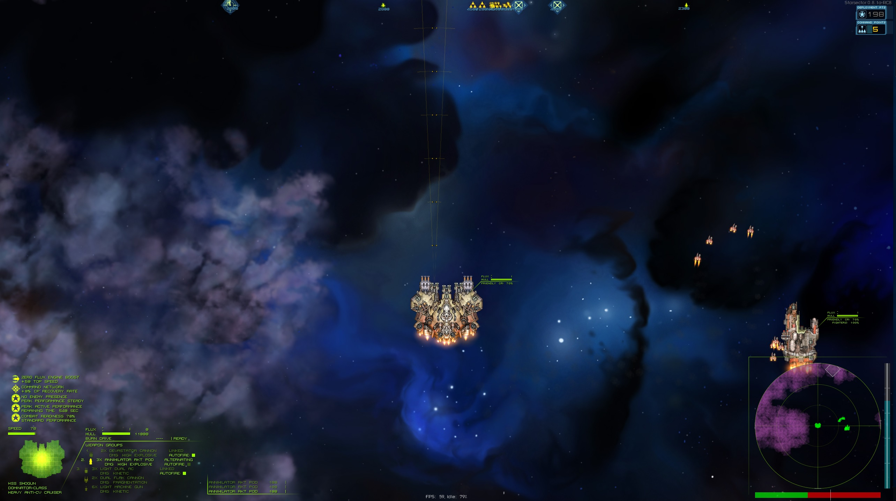

# Weapon Arcs

This is a mod for the game Starsector, which allows drawing all the weapon arcs of the player ship, not just the ones from the currently selected weapon group. This is especcially usefull when selecting a missile weapon group, while still needing to aim other weapons.

**Config**

In weapon-arcs-settings.json you can:
- Change the color of the weapons arcs 
- Set options to auto enable arcs on weapon groups
- Change the number of range bands displayed on the weapon arcs
- You can set the roughness of the displayed weapon arc. For more smooth arch, set a lower number (minimum 1. This will draw for each degree in the arc). For a blocky arc, set a higher number (don't go over 50).
- Turn on individual colors for each weapon group (default off)
- set a key which will toggle whether 1-7 triggers the arcs. This is mainly for users where the Alt key does not work, such as on a mac.

**Game forum thread**
http://fractalsoftworks.com/forum/index.php?topic=13535.0

**Contribution**
If you want to contribute to this mod, you're welcome to submit a pull request.

**Examples**

vanilla vs the mod:

**Credits goes to**
LazyWizard - the creator of Lazylib, which is used for vector rotation in this mod.
