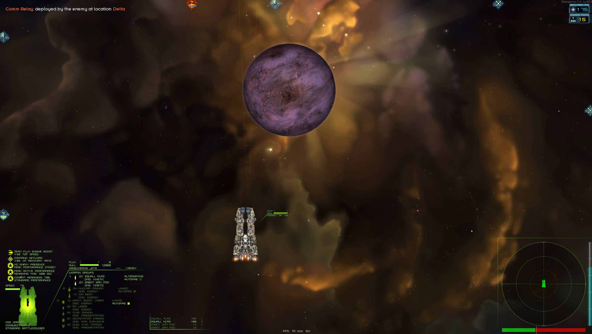
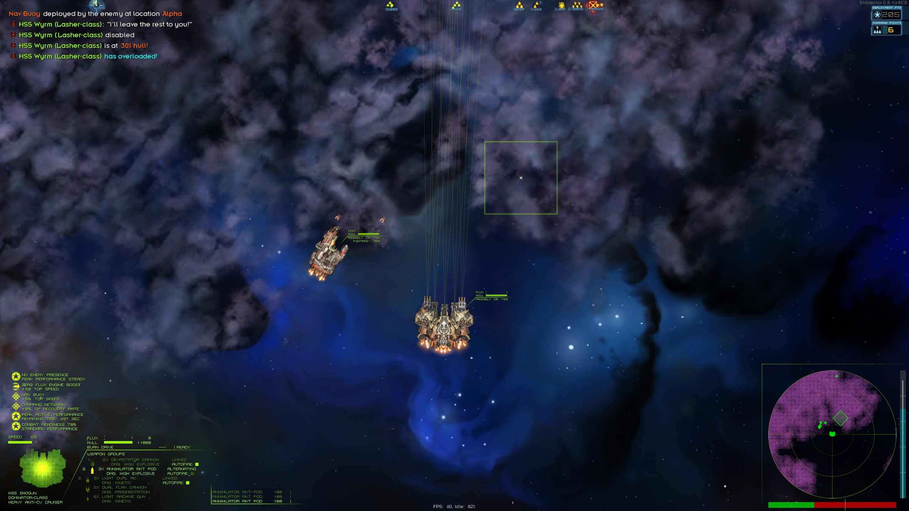
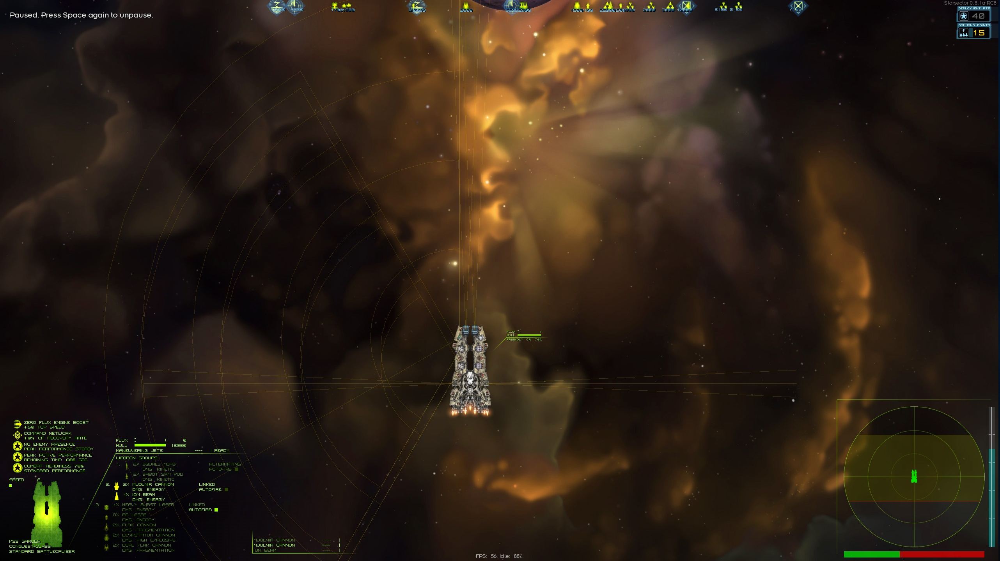

# Weapon Arcs
This is a mod for the game Starsector, which draws all the weapon arcs of the player ship, not just the ones from the currently selected weapon group. This is especcially usefull when selecting a missile weapon group, while still needing to aim other weapons. 

**Contribution**
If you want to contribute to this mod, you're welcome to submit a pull request.

vanilla vs the mod:

**Credits goes to**
LazyWizard - the creator of Lazylib, which is used for vector rotation in this mos.

